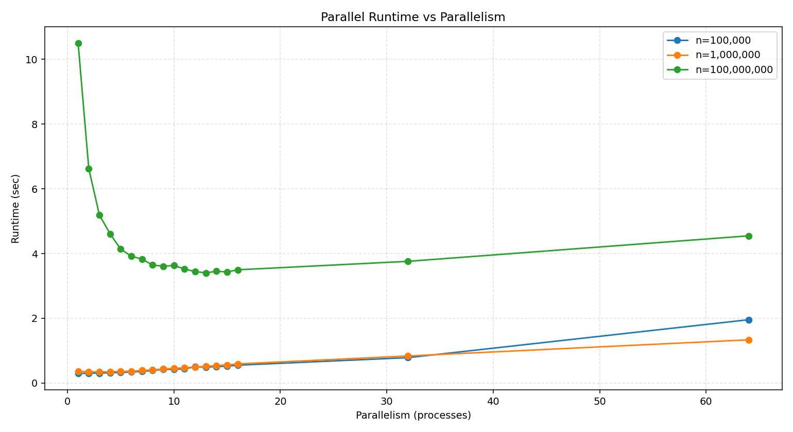
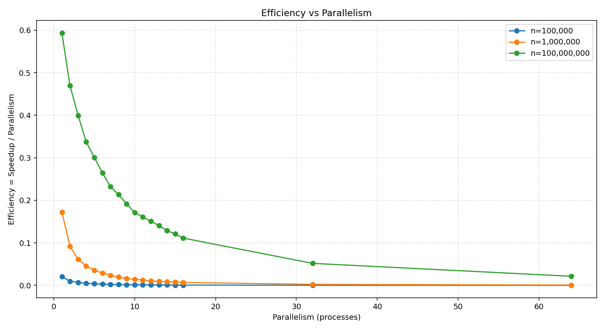

# Лабораторная работа №1 (Вариант 2, Python)

Тема: **Параллельные вычисления и пределы масштабирования**  
Задача: **Расчет статистики массива** (сумма, среднее, дисперсия, минимум, максимум).

## Что реализовано

- Последовательная версия расчета статистик.
- Параллельная версия на `multiprocessing` с параметром уровня параллелизма.
- Проверка совпадения результатов последовательной и параллельной версий.
- Анализ детерминизма (`N > 100` запусков).
- Серия экспериментов на разных размерах входа и уровнях параллелизма:
  `1..MAX_CPU, 2*MAX_CPU, 4*MAX_CPU`.
- Вычисление метрик:
  - время выполнения;
  - ускорение `S(p) = T_seq / T_par`;
  - эффективность `E(p) = S(p) / p`.
- Построение графиков (`matplotlib`) и сохранение результатов в CSV.

## Установка

```bash
python -m pip install numpy matplotlib
```

## Запуск

```bash
python main.py
```

Пример с ручными параметрами:

```bash
python main.py --sizes 200000 800000 2000000 --repeats 3 --seed 42 --det-runs 120 --output-dir results
```

## Краткое объяснение параллелизма в решении

### Что параллелится

Массив делится на чанки. Для каждого чанка независимо считаются:

- частичная сумма
- частичная сумма квадратов
- локальный минимум и максимум

Эти вычисления независимы и хорошо распараллеливаются.

### Что не параллелится (или слабо)

- разбиение данных на чанки
- запуск/синхронизация worker-процессов
- финальная редукция частичных результатов в итоговые метрики

### Особенности Python

- В CPython есть GIL, поэтому для CPU-bound задач используется `multiprocessing`, а не потоки.
- Узкие места:
  - накладные расходы на сериализацию и передачу данных между процессами
  - стоимость создания процессов
  - oversubscription (`p > CPU`) обычно снижает эффективность


## Лог результатов

```cmd
Detected CPU cores: 16
Parallelism levels: [1, 2, 3, 4, 5, 6, 7, 8, 9, 10, 11, 12, 13, 14, 15, 16, 32, 64]

[size=100000] sequential time (median, 3 runs): 0.006030 sec
  p=  1: par=0.292590s | speedup=0.021 | efficiency=0.021
  p=  2: par=0.303738s | speedup=0.020 | efficiency=0.010
  p=  3: par=0.304713s | speedup=0.020 | efficiency=0.007
  p=  4: par=0.320214s | speedup=0.019 | efficiency=0.005
  p=  5: par=0.323138s | speedup=0.019 | efficiency=0.004
  p=  6: par=0.342771s | speedup=0.018 | efficiency=0.003
  p=  7: par=0.356137s | speedup=0.017 | efficiency=0.002
  p=  8: par=0.388223s | speedup=0.016 | efficiency=0.002
  p=  9: par=0.418692s | speedup=0.014 | efficiency=0.002
  p= 10: par=0.422911s | speedup=0.014 | efficiency=0.001
  p= 11: par=0.441010s | speedup=0.014 | efficiency=0.001
  p= 12: par=0.497820s | speedup=0.012 | efficiency=0.001
  p= 13: par=0.489846s | speedup=0.012 | efficiency=0.001
  p= 14: par=0.508149s | speedup=0.012 | efficiency=0.001
  p= 15: par=0.519515s | speedup=0.012 | efficiency=0.001
  p= 16: par=0.550901s | speedup=0.011 | efficiency=0.001
  p= 32: par=0.782785s | speedup=0.008 | efficiency=0.000
  p= 64: par=1.955711s | speedup=0.003 | efficiency=0.000

[size=1000000] sequential time (median, 3 runs): 0.063407 sec
  p=  1: par=0.367408s | speedup=0.173 | efficiency=0.173
  p=  2: par=0.347070s | speedup=0.183 | efficiency=0.091
  p=  3: par=0.343201s | speedup=0.185 | efficiency=0.062
  p=  4: par=0.349950s | speedup=0.181 | efficiency=0.045
  p=  5: par=0.355422s | speedup=0.178 | efficiency=0.036
  p=  6: par=0.364167s | speedup=0.174 | efficiency=0.029
  p=  7: par=0.387776s | speedup=0.164 | efficiency=0.023
  p=  8: par=0.403679s | speedup=0.157 | efficiency=0.020
  p=  9: par=0.434155s | speedup=0.146 | efficiency=0.016
  p= 10: par=0.449634s | speedup=0.141 | efficiency=0.014
  p= 11: par=0.470120s | speedup=0.135 | efficiency=0.012
  p= 12: par=0.496175s | speedup=0.128 | efficiency=0.011
  p= 13: par=0.513154s | speedup=0.124 | efficiency=0.010
  p= 14: par=0.538067s | speedup=0.118 | efficiency=0.008
  p= 15: par=0.558240s | speedup=0.114 | efficiency=0.008
  p= 16: par=0.590025s | speedup=0.107 | efficiency=0.007
  p= 32: par=0.835568s | speedup=0.076 | efficiency=0.002
  p= 64: par=1.334545s | speedup=0.048 | efficiency=0.001

[size=100000000] sequential time (median, 3 runs): 6.222557 sec
  p=  1: par=10.493595s | speedup=0.593 | efficiency=0.593
  p=  2: par=6.622977s | speedup=0.940 | efficiency=0.470
  p=  3: par=5.189392s | speedup=1.199 | efficiency=0.400
  p=  4: par=4.608354s | speedup=1.350 | efficiency=0.338
  p=  5: par=4.136095s | speedup=1.504 | efficiency=0.301
  p=  6: par=3.916024s | speedup=1.589 | efficiency=0.265
  p=  7: par=3.828619s | speedup=1.625 | efficiency=0.232
  p=  8: par=3.643215s | speedup=1.708 | efficiency=0.213
  p=  9: par=3.608202s | speedup=1.725 | efficiency=0.192
  p= 10: par=3.631724s | speedup=1.713 | efficiency=0.171
  p= 11: par=3.520966s | speedup=1.767 | efficiency=0.161
  p= 12: par=3.443040s | speedup=1.807 | efficiency=0.151
  p= 13: par=3.404065s | speedup=1.828 | efficiency=0.141
  p= 14: par=3.452419s | speedup=1.802 | efficiency=0.129
  p= 15: par=3.431715s | speedup=1.813 | efficiency=0.121
  p= 16: par=3.498007s | speedup=1.779 | efficiency=0.111
  p= 32: par=3.759132s | speedup=1.655 | efficiency=0.052
  p= 64: par=4.547389s | speedup=1.368 | efficiency=0.021

Determinism check: runs=120, size=1000000, parallelism=16
Deterministic: True
```

## Графики

### Зависимость скорости выполнения от параллелизма


### График показателей эффективности параллелизма


## Выводы

* Python на multiprocessing имеет сильный overhead, поэтому эффективен только для очень больших массивов.
* Efficiency падает при росте числа процессов, т.к. overhead и межпроцессные копии данных начинают съедать выигрыш.
* На малых и средних данных последовательная версия гораздо быстрее.
* Детерминированность работает - проверка 120 прогонов подтверждает reproducibility.
* С/С++ дали бы реальный ускоряющий эффект, т.к. там нет большого process overhead и можно работать с потоками на уровне CPU.
