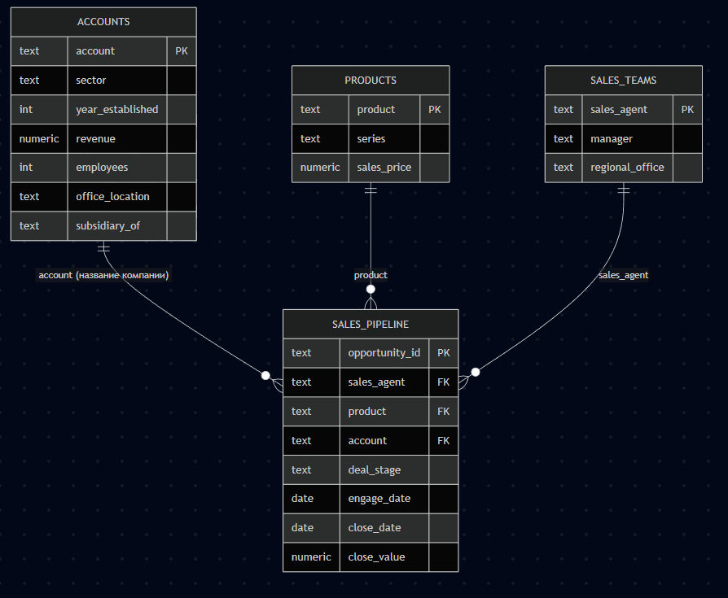
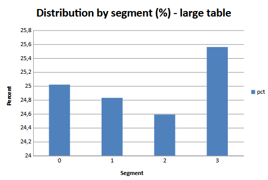
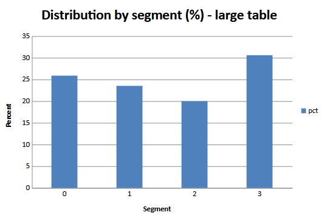

# Лабораторная №3: Greenplum + PostgreSQL (PXF) + gpfdist

Вариант **1 (PostgreSQL)** и **усложнёнение gpfdist**. Датасет **CRM Sales Opportunities** (Maven Analytics), CSV в `./data`.

## ER-диаграмма датасета



## Архитектура Docker

| Сервис     | Назначение |
|-----------|------------|
| `segment1`, `segment2` | Две сегмент-ноды (на каждой по 2 primary-сегмента → **4 сегмента** в кластере) |
| `master`   | Мастер Greenplum, порт `5432`, PXF включён |
| `postgres` | PostgreSQL 16, БД `crm`, таблицы загружаются из `./data` при первом старте |
| `gpfdist`  | Отдельный контейнер: раздаёт `./data` по HTTP (порт `8080`) |

Образ кластера: **`woblerr/greenplum:6.27.1`** (1 master + 2 segment-контейнера по образу из [docker-greenplum](https://github.com/woblerr/docker-greenplum)).

## Выполнение

Подготовка ssh и secrets:

```powershell
> .\scripts\prepare.ps1
Создан \secrets\gpdb_password из примера (пароль gpadmin: gparray).
Сгенерированы SSH-ключи в conf\ssh (нужны для woblerr/greenplum multi-node).
Подготовка завершена
```

Запуск:

```powershell
> docker compose up -d
[+] Running 6/6
 ✔ Network lab3pirod_labnet  Created
 ✔ Container segment1        Healthy
 ✔ Container segment2        Healthy 
 ✔ Container lab_gpfdist     Started
 ✔ Container lab_postgres    Healthy
 ✔ Container master          Started      
```

Проверка `master` ноды:

```powershell
> docker compose exec -u gpadmin master bash -lc "source /usr/local/greenplum-db/greenplum_path.sh && psql -d demo -c 'SELECT version();'"
PostgreSQL 9.4.26 (Greenplum Database 6.27.1 build dev) on x86_64-unknown-linux-gnu, compiled by gcc (Ubuntu 11.4.0-1ubuntu1~22.04.3) 11.4.0, 64-bit compiled on Mar 25 2026 20:51:24 
(1 row)
```

Синхронизация PXF:

```powershell
> .\scripts\pxf_sync.ps1
Syncing PXF configuration files from coordinator host to 2 segment hosts...
PXF configs synced successfully on 2 out of 2 hosts
```

Подключение к Greenplum **из контейнера master** (пароль по умолчанию из `secrets/gpdb_password` — `gparray`):

```powershell
> docker compose exec -u gpadmin master bash -lc "source /usr/local/greenplum-db/greenplum_path.sh && psql -d demo"
psql (9.4.26)        
Type "help" for help.

demo=# 
```

Выполнение `sql` по порядку:

```bash
\i /workspace/greenplum/01_pxf_jdbc_external.sql
\i /workspace/greenplum/02_create_tables_load.sql
```

## Анализ распределения

Скрипт `greenplum/04_skew.sql` выдаёт `gp_segment_id`, число строк и `%` по сегментам, а также `skew_ratio_max_over_min`.

```bash
\i /workspace/greenplum/04_skew.sql
```

На основе результатов получаем:


Таблица `sales_pipeline`

```sql
SELECT gp_segment_id, COUNT(*) AS rows_cnt,
       ROUND(100.0 * COUNT(*) / SUM(COUNT(*)) OVER (), 2) AS pct
FROM sales_pipeline
GROUP BY gp_segment_id
ORDER BY gp_segment_id;
```



- **`sales_pipeline`** — `DISTRIBUTED BY (opportunity_id)`: уникальный идентификатор сделки, высокая кардинальность → **ровное** распределение по сегментам.

Таблица `accounts`:

```sql
SELECT gp_segment_id, COUNT(*) AS rows_cnt,
       ROUND(100.0 * COUNT(*) / SUM(COUNT(*)) OVER (), 2) AS pct
FROM accounts
GROUP BY gp_segment_id
ORDER BY gp_segment_id;
```



- **`accounts`** — `DISTRIBUTED BY (account)`: совпадает с полем соединения в факте → при корректном подборе запросов меньше **Redistribute** при JOIN по `account`.

`skew ~ 1.04`

## Анализ планов запросов:

```powershell
\i /workspace/greenplum/05_queries_explain.sql
```

```sql
-- Запрос 1: воронка + компании (JOIN по account)

EXPLAIN (COSTS OFF, VERBOSE)
SELECT p.deal_stage, COUNT(*), SUM(p.close_value)
FROM sales_pipeline p
JOIN accounts a ON a.account = p.account
GROUP BY p.deal_stage;
```

План выполнения:
- Broadcast Motion 4:4 (slice1): Копирование таблицы accounts на все сегменты
- Hash Join: Соединение sales_pipeline и accounts по account
- HashAggregate: Локальная агрегация (COUNT, SUM) по deal_stage на сегментах
- Redistribute Motion 4:4 (slice2): Перераспределение данных по sales_pipeline.deal_stage
- Sort → GroupAggregate: Финальная агрегация по deal_stage
- Gather Motion 4:1 (slice3): Сбор результата на мастер-узел

Избыточные движения данных:

- Используется Broadcast Motion для таблицы accounts
- Используется Redistribute Motion по deal_stage для финальной агрегации

```sql
-- Запрос 2: три таблицы — сделки, продукты, команды продаж

EXPLAIN (COSTS OFF, VERBOSE)
SELECT t.regional_office, pr.series, COUNT(*)
FROM sales_pipeline p
JOIN products pr ON pr.product = p.product
JOIN sales_teams t ON t.sales_agent = p.sales_agent
GROUP BY t.regional_office, pr.series;
```

План выполнения:
- Broadcast Motion 4:4 (slice1): Копирование таблицы sales_teams на все сегменты
- Broadcast Motion 4:4 (slice2): Копирование таблицы products на все сегменты
- Hash Join (1): Соединение sales_pipeline и sales_teams по sales_agent
- Hash Join (2): Соединение результата с products по product
- HashAggregate: Локальная агрегация по regional_office, series
- Redistribute Motion 4:4 (slice3): Перераспределение данных по sales_teams.regional_office, products.series
- Sort → GroupAggregate: Финальная агрегация
- Gather Motion 4:1 (slice4): Сбор результата на мастер

Избыточные движения данных:

- Выполняются 2 Broadcast Motion:
    - sales_teams
    - products
- Выполняется Redistribute Motion по двум полям (regional_office, series)

```sql
-- Запрос 3: иерархия компаний (дочерние счета) + суммы по сделкам

EXPLAIN (COSTS OFF, VERBOSE)
SELECT COALESCE(a.subsidiary_of, a.account) AS group_name,
       COUNT(DISTINCT p.opportunity_id) AS deals,
       SUM(p.close_value) AS revenue
FROM sales_pipeline p
JOIN accounts a ON a.account = p.account
WHERE p.deal_stage = 'Won'
GROUP BY 1
ORDER BY revenue DESC NULLS LAST
LIMIT 20;
```

План выполнения:
- Broadcast Motion 4:4 (slice1): Копирование таблицы accounts на все сегменты
- Hash Join: Соединение sales_pipeline и accounts по account
- Seq Scan + Filter: Сканирование sales_pipeline с фильтром deal_stage = 'Won'
- HashAggregate (1): Локальная агрегация по
COALESCE(subsidiary_of, account), opportunity_id
(реализация COUNT DISTINCT)
- Redistribute Motion 4:4 (slice2): Перераспределение по
COALESCE(subsidiary_of, account)
- HashAggregate (2): Финальная агрегация по группе компаний
- Sort: Сортировка по SUM(close_value) DESC
- Limit (локальный): Ограничение на сегментах
- Gather Motion 4:1 (slice3): Сбор результатов на мастер с merge по сумме
- Limit (финальный): Вывод TOP-20

Redistribution:

```powershell
\i /workspace/greenplum/06_redistribute.sql 
```

```sql
ALTER TABLE sales_pipeline SET DISTRIBUTED BY (account);
ANALYZE sales_pipeline;
ALTER TABLE accounts SET DISTRIBUTED BY (sector);
ALTER TABLE sales_teams SET DISTRIBUTED BY (regional_office);
```

После изменения ключей распределения ухудшилась эффективность выполнения запросов, так как нарушилась коллокация таблиц по ключам соединения. 

Broadcast Motion был заменён на более дорогой Redistribute Motion, что увеличило сетевые затраты. При этом операции Redistribute, связанные с группировкой и агрегацией, остались.

Наиболее негативный эффект наблюдается в сложных запросах с несколькими JOIN и DISTINCT, где увеличилось количество операций перераспределения данных.

## gpfdist

```powershell
docker compose up -d --build gpfdist
```

Затем в `psql` на master:

```bash
\i /workspace/greenplum/03_gpfdist.sql
```

Проверка:

```sql
# select account, sector, employees from accounts_from_gpfdist;
           account            |       sector       | employees 
------------------------------+--------------------+-----------
 Blackzim                     | retail             |      1588
 Bubba Gump                   | software           |      2253
 Conecom                      | technolgy          |      1806
 Faxquote                     | telecommunications |      5595
 Funholding                   | finance            |      7227
 Ganjaflex                    | retail             |     17479
 Gekko & Co                   | retail             |      3502
 Genco Pura Olive Oil Company | retail             |      1635
 Goodsilron                   | marketing          |      5107
 Hottechi                     | technolgy          |     16499
 Initech                      | telecommunications |     20275
 Kinnamplus                   | retail             |      1831
 Massive Dynamic              | entertainment      |      1095
 Opentech                     | finance            |       853
 Rangreen                     | technolgy          |      8775
 Rundofase                    | technolgy          |      1238
 Sumace                       | retail             |       493
 ...
 ```

